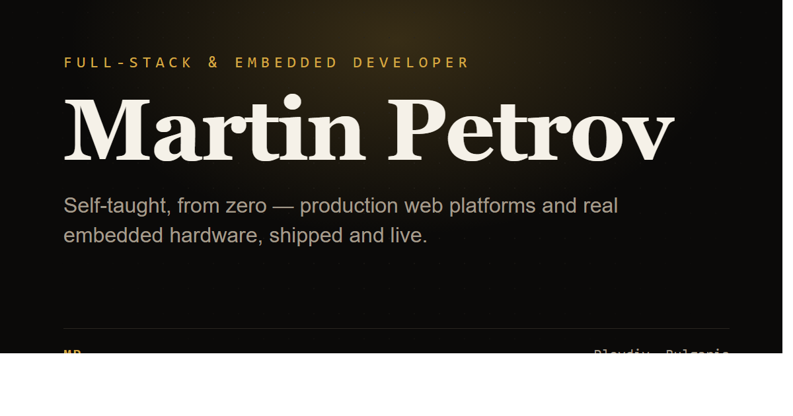
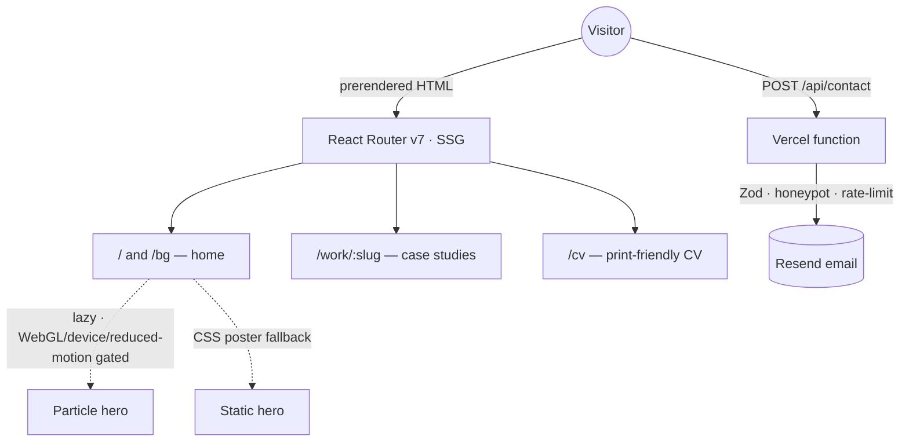

# Martin Petrov — Portfolio



A cinematic, bilingual (EN/BG) portfolio for a self-taught full-stack **and**
embedded developer. Built to make clients say _"wow"_ and engineers say _"how"_:
a single-page scroll for skimming, deep case studies for scrutiny.

## Highlights

- **Static-prerendered** with React Router v7 framework mode — every route ships
  as plain HTML for SEO and a fast first paint; no runtime server.
- **Bilingual** (English-first, Bulgarian at `/bg`) with a tiny, fully-typed
  i18n layer — a translation key must exist in both languages or the build fails.
- **WebGL particle hero** (react-three-fiber) that morphs between an engineering
  dot-lattice and the initials "MP" — lazy-loaded, capability-gated, with a CSS
  poster fallback so it never costs the initial bundle or the LCP.
- **Working contact form** backed by a Vercel serverless function (Zod
  validation, honeypot, rate-limit, Resend).
- **Accessible & motion-aware**: keyboard nav, skip link, AA/AAA contrast,
  `prefers-reduced-motion` honored throughout.

## Stack

`Vite` · `React 19` · `TypeScript (strict)` · `React Router v7 (SSG)` ·
`Tailwind v4` · `Framer Motion` · `react-three-fiber / three` · `Resend` ·
`Vercel`

## Architecture



## Engineering notes (the "how")

- **SSG on Vite 8**: `vite-react-ssg` doesn't support Vite 8, so the site uses
  React Router v7's framework mode (`ssr: false` + `prerender`) — first-party,
  and head/meta/`lang`/hreflang come for free.
- **Typed i18n** instead of a runtime library: a single dictionary, compile-time
  checked across both locales — better for SSG and zero client cost.
- **3D, contained**: `three` (~226 KB gz) lives in its own lazy chunk and only
  mounts on capable desktops after the browser is idle; the initial bundle stays
  ~155 KB gz.
- **Zero font-swap shift**: metric-matched fallback `@font-face`s (generated from
  the real font files) keep CLS near zero.
- **The repo is itself a portfolio piece** — strict types, CI, and a measured
  performance budget.

## Scripts

| Command | Description |
| --- | --- |
| `npm run dev` | Dev server |
| `npm run build` | Prerender all routes to `build/client` (runs `seo:gen` first) |
| `npm run typecheck` | React Router typegen + `tsc` |
| `npm run lint` / `npm run format` | ESLint / Prettier |
| `npm run og:gen` | Render the OpenGraph card → `public/og-image.png` |
| `npm run cv:gen` | Print `/cv` → `public/cv.pdf` (run with Chrome closed) |

## Local development

```bash
npm install
npm run dev
```

## Deploy (Vercel)

- Build command `npm run build`, output `build/client`; `api/` deploys as a
  serverless function automatically.
- Environment variables:
  - `VITE_SITE_URL` — canonical origin (used for canonical/OG/sitemap URLs).
  - `RESEND_API_KEY` — enables the contact form. Optional `CONTACT_TO`.

## Built with

React · TypeScript · Tailwind · Three.js — and a lot of shipping.
